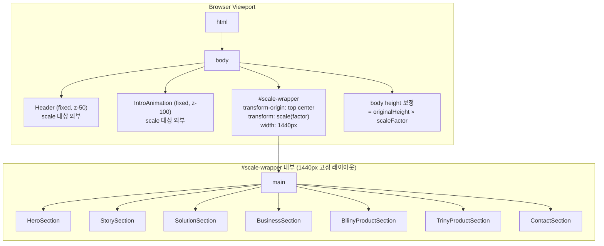
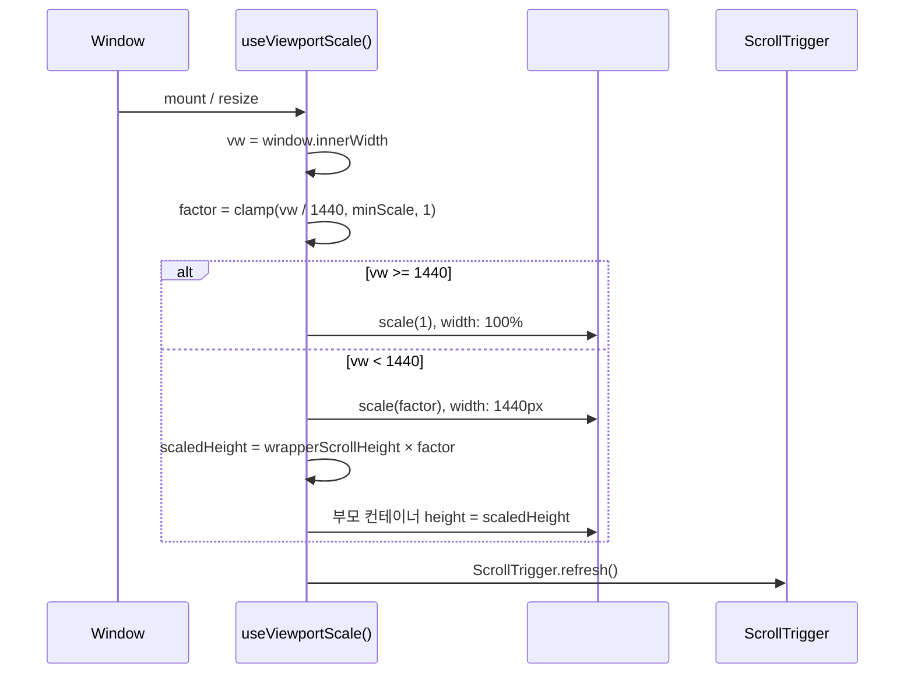
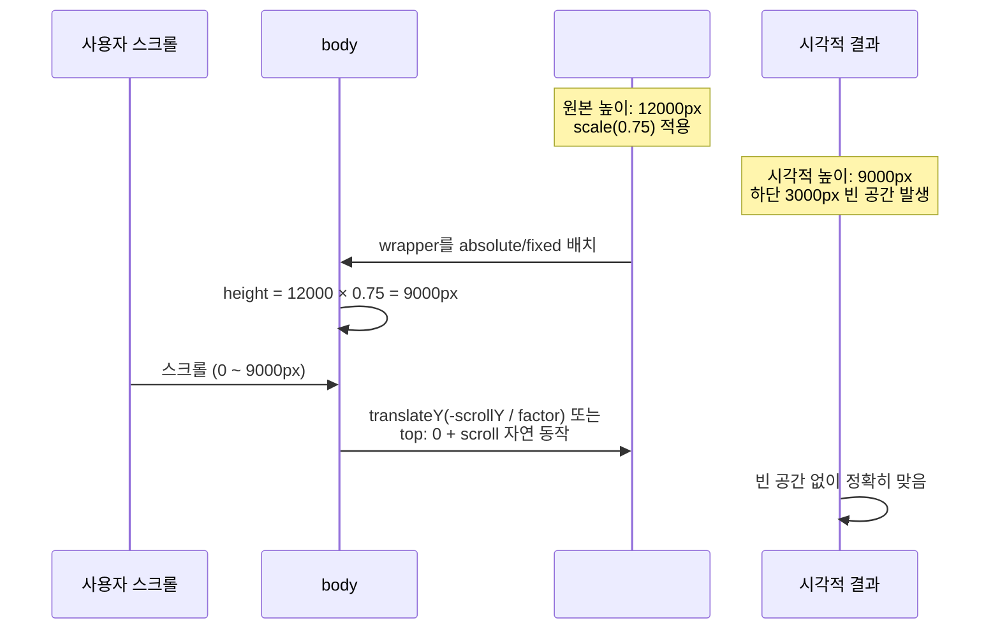

# Design Document: Viewport Scale System

## Overview

1440px 기준 데스크톱 디자인을 뷰포트 너비에 비례하여 통째로 축소하는 시스템이다. CSS `transform: scale()` 을 최상위 컨테이너에 적용하여, 이미지를 줄이듯 모든 자식 요소(텍스트, 이미지, absolute 요소 등)의 비율과 위치를 100% 유지한 채 축소한다.

핵심 과제는 세 가지다:
1. **스크롤 높이 보정** — `scale()` 은 시각적 크기만 줄이고 레이아웃 높이는 원본 그대로이므로, 실제 스크롤 가능 영역과 시각적 콘텐츠 높이 사이의 불일치를 해결해야 한다.
2. **GSAP ScrollTrigger 호환** — pin, scrub, start/end 계산이 scale 후에도 정확히 동작해야 한다.
3. **Canvas 이미지 시퀀스 호환** — HeroSection의 canvas는 `window.innerWidth/Height` 기준으로 그리므로 scale 컨테이너 밖에서 독립 처리하거나, scale 보정 로직이 필요하다.

## Architecture



## Sequence Diagrams

### 초기화 및 리사이즈 흐름



### 스크롤 높이 보정 메커니즘



## Components and Interfaces

### Component 1: `useViewportScale` Hook

**Purpose**: 뷰포트 너비를 감지하여 scale factor를 계산하고, wrapper 요소에 transform을 적용하며, 스크롤 높이를 보정한다.

**Interface**:
```typescript
interface ViewportScaleConfig {
  /** 기준 너비 (기본값: 1440) */
  baseWidth: number;
  /** 최소 scale 비율 (기본값: 0.25, 즉 360px) */
  minScale: number;
  /** scale 적용 대상 ref */
  wrapperRef: RefObject<HTMLDivElement | null>;
}

interface ViewportScaleResult {
  /** 현재 scale factor (0.25 ~ 1.0) */
  scaleFactor: number;
  /** scale 적용 여부 (vw < baseWidth일 때 true) */
  isScaled: boolean;
}

function useViewportScale(config: ViewportScaleConfig): ViewportScaleResult;
```

**Responsibilities**:
- `window.innerWidth` 기반 scale factor 계산
- `ResizeObserver` + `resize` 이벤트로 실시간 반응
- wrapper에 `transform: scale()`, `transform-origin: top center`, `width: {baseWidth}px` 적용
- 스크롤 높이 보정 (wrapper 부모의 height를 `scrollHeight × factor`로 설정)
- `ScrollTrigger.refresh()` 호출로 GSAP 트리거 위치 재계산
- `will-change: transform` GPU 가속 힌트

### Component 2: `ScaleWrapper` Component

**Purpose**: scale 변환이 적용되는 최상위 래퍼. page.tsx에서 `<main>` 을 감싸는 컨테이너.

**Interface**:
```typescript
interface ScaleWrapperProps {
  children: React.ReactNode;
}

function ScaleWrapper({ children }: ScaleWrapperProps): JSX.Element;
```

**Responsibilities**:
- `useViewportScale` 훅 사용
- wrapper div + 높이 보정용 outer div 렌더링
- fixed/absolute 요소(Header, IntroAnimation)는 이 컴포넌트 외부에 위치

### Component 3: 기존 컴포넌트 수정 사항

**Header (fixed)**: scale-wrapper 외부에 위치하므로 변경 불필요. 단, Header 자체의 반응형은 별도 처리 필요 (현재 Tailwind 반응형 유지 또는 별도 scale 적용).

**HeroSection (canvas)**: canvas의 `resizeCanvas()` 가 `window.innerWidth/Height` 를 사용하므로, scale-wrapper 내부에 있어도 canvas 크기는 실제 뷰포트 기준으로 그려야 한다. 두 가지 접근:
- **방법 A**: canvas를 scale-wrapper 외부로 분리 → 구조 변경 큼
- **방법 B (권장)**: canvas 크기 계산 시 `1 / scaleFactor` 보정 적용 → 최소 변경

**ScrollTrigger pin 요소**: `pin: true` 사용 시 GSAP이 pinSpacer를 생성하는데, scale된 컨테이너 내부에서 pin 동작이 정상인지 검증 필요. `pinType: "transform"` 이 기본값이므로 scale과 충돌 가능 → `pinType: "fixed"` 또는 pin 대상을 scale-wrapper 외부로 분리 고려.

## Data Models

### Scale State

```typescript
interface ScaleState {
  /** 현재 뷰포트 너비 */
  viewportWidth: number;
  /** 계산된 scale factor */
  factor: number;
  /** wrapper의 원본(unscaled) scrollHeight */
  originalHeight: number;
  /** 보정된 스크롤 높이 = originalHeight × factor */
  correctedHeight: number;
}
```

**Validation Rules**:
- `factor`는 항상 `[minScale, 1.0]` 범위
- `viewportWidth >= baseWidth` 이면 `factor = 1.0`
- `correctedHeight`는 항상 양수

### CSS Custom Properties

```typescript
// CSS 변수로 scale factor를 전파하여 필요한 곳에서 참조
interface ScaleCSSProperties {
  '--scale-factor': string;      // e.g., "0.75"
  '--scale-inverse': string;     // e.g., "1.3333" (1/factor)
  '--base-width': string;        // "1440px"
}
```


## Algorithmic Pseudocode

### 핵심 알고리즘 1: Scale Factor 계산

```typescript
ALGORITHM computeScaleFactor(viewportWidth, baseWidth, minScale)
INPUT: viewportWidth: number, baseWidth: number (1440), minScale: number (0.25)
OUTPUT: factor: number

BEGIN
  IF viewportWidth >= baseWidth THEN
    RETURN 1.0
  END IF

  factor ← viewportWidth / baseWidth
  RETURN Math.max(factor, minScale)
END
```

**Preconditions:**
- `viewportWidth > 0`
- `baseWidth > 0`
- `0 < minScale <= 1.0`

**Postconditions:**
- `minScale <= factor <= 1.0`
- `viewportWidth >= baseWidth` ⟹ `factor === 1.0`
- `viewportWidth < baseWidth` ⟹ `factor === max(viewportWidth / baseWidth, minScale)`

### 핵심 알고리즘 2: 스크롤 높이 보정

```typescript
ALGORITHM applyScrollHeightCorrection(wrapper, outerContainer, factor)
INPUT: wrapper: HTMLDivElement, outerContainer: HTMLDivElement, factor: number
OUTPUT: void (side effect: outerContainer.style.height 설정)

BEGIN
  // wrapper는 scale 전 원본 크기로 레이아웃됨
  originalHeight ← wrapper.scrollHeight
  
  // scale 후 시각적 높이
  correctedHeight ← originalHeight × factor
  
  // outer container의 높이를 시각적 높이로 설정
  // → 브라우저 스크롤바가 이 높이 기준으로 동작
  outerContainer.style.height ← correctedHeight + "px"
  
  // wrapper는 outer 내부에서 position: sticky 또는 fixed로
  // 뷰포트 상단에 고정 → 스크롤은 outer가 담당
  wrapper.style.position ← "sticky"
  wrapper.style.top ← "0"
  
  ScrollTrigger.refresh()
END
```

**Preconditions:**
- `wrapper`가 DOM에 마운트되어 있고 `scrollHeight > 0`
- `0 < factor <= 1.0`

**Postconditions:**
- `outerContainer.style.height === (wrapper.scrollHeight × factor) + "px"`
- 스크롤바 범위가 시각적 콘텐츠 높이와 일치
- ScrollTrigger의 start/end 위치가 보정된 높이 기준으로 재계산됨

### 핵심 알고리즘 3: Wrapper Transform 적용

```typescript
ALGORITHM applyScaleTransform(wrapper, factor, baseWidth)
INPUT: wrapper: HTMLDivElement, factor: number, baseWidth: number
OUTPUT: void (side effect: wrapper.style 변경)

BEGIN
  IF factor >= 1.0 THEN
    // 1440px 이상: scale 해제, 자연스러운 레이아웃
    wrapper.style.transform ← "none"
    wrapper.style.width ← "100%"
    wrapper.style.transformOrigin ← ""
    wrapper.style.willChange ← "auto"
  ELSE
    // 1440px 미만: 고정 너비 + scale 축소
    wrapper.style.width ← baseWidth + "px"
    wrapper.style.transformOrigin ← "top center"
    wrapper.style.transform ← `scale(${factor})`
    wrapper.style.willChange ← "transform"
  END IF
  
  // CSS 변수 전파 (하위 컴포넌트에서 참조 가능)
  document.documentElement.style.setProperty('--scale-factor', String(factor))
  document.documentElement.style.setProperty('--scale-inverse', String(1 / factor))
END
```

**Preconditions:**
- `wrapper`가 DOM에 마운트됨
- `factor`가 유효한 범위 `[minScale, 1.0]`

**Postconditions:**
- `factor >= 1.0` ⟹ transform 없음, width 100%
- `factor < 1.0` ⟹ `transform: scale(factor)`, `width: baseWidth`
- CSS 변수 `--scale-factor`, `--scale-inverse`가 `:root`에 설정됨

### 핵심 알고리즘 4: Canvas 크기 보정 (HeroSection)

```typescript
ALGORITHM resizeCanvasWithScale(canvas, ctx, scaleFactor)
INPUT: canvas: HTMLCanvasElement, ctx: CanvasRenderingContext2D, scaleFactor: number
OUTPUT: void

BEGIN
  dpr ← window.devicePixelRatio || 1
  
  // scale-wrapper 내부의 canvas는 1440px 기준 좌표계
  // 실제 뷰포트에 맞추려면 inverse scale 적용
  IF scaleFactor < 1.0 THEN
    // 방법 B: canvas 자체에 inverse scale
    // canvas의 CSS 크기는 wrapper 내에서 100vw = 1440px
    // 실제 그릴 영역은 뷰포트 크기 / scaleFactor
    cw ← 1440
    ch ← window.innerHeight / scaleFactor
  ELSE
    cw ← window.innerWidth
    ch ← window.innerHeight
  END IF
  
  canvas.width ← cw × dpr
  canvas.height ← ch × dpr
  ctx.setTransform(dpr, 0, 0, dpr, 0, 0)
END
```

**Preconditions:**
- canvas가 scale-wrapper 내부에 위치
- `scaleFactor > 0`

**Postconditions:**
- canvas 해상도가 실제 표시 영역에 맞게 설정됨
- scale 적용 후에도 이미지 시퀀스가 뷰포트를 정확히 채움

## Key Functions with Formal Specifications

### `useViewportScale(config)`

```typescript
function useViewportScale(config: ViewportScaleConfig): ViewportScaleResult
```

**Preconditions:**
- `config.baseWidth > 0` (기본값 1440)
- `0 < config.minScale <= 1.0` (기본값 0.25)
- `config.wrapperRef.current`가 마운트 시점에 유효한 DOM 요소

**Postconditions:**
- 반환값 `scaleFactor`는 `[minScale, 1.0]` 범위
- `isScaled === (scaleFactor < 1.0)`
- wrapper 요소에 `transform: scale(factor)` 적용됨
- 스크롤 높이가 보정됨
- `resize` 이벤트 시 자동 재계산

**Loop Invariants:** N/A (이벤트 기반)

### `computeScaleFactor(vw, base, min)`

```typescript
function computeScaleFactor(
  viewportWidth: number,
  baseWidth: number,
  minScale: number
): number
```

**Preconditions:**
- 모든 인자가 양수

**Postconditions:**
- 반환값 ∈ `[minScale, 1.0]`
- 순수 함수 (side effect 없음)

### `applyCorrectedHeight(wrapper, outer, factor)`

```typescript
function applyCorrectedHeight(
  wrapper: HTMLDivElement,
  outer: HTMLDivElement,
  factor: number
): void
```

**Preconditions:**
- 두 요소 모두 DOM에 마운트됨
- `wrapper.scrollHeight > 0`
- `0 < factor <= 1.0`

**Postconditions:**
- `outer.style.height === Math.round(wrapper.scrollHeight * factor) + "px"`
- ScrollTrigger.refresh() 호출됨

## Example Usage

### page.tsx 적용 예시

```typescript
// src/app/page.tsx
import { ScaleWrapper } from "@/components/layout/ScaleWrapper";

export default function Home() {
  return (
    <>
      {/* scale 외부: fixed 요소들 */}
      <IntroAnimation />
      <ScrollTriggerRefreshController />
      <Header />

      {/* scale 내부: 모든 콘텐츠 */}
      <ScaleWrapper>
        <main>
          <HeroSection />
          <StorySection />
          <SolutionSection />
          <BusinessSection />
          <BilinyProductSection />
          <TrinyProductSection />
          <ContactSection />
        </main>
      </ScaleWrapper>
    </>
  );
}
```

### ScaleWrapper 구현 예시

```typescript
// src/components/layout/ScaleWrapper.tsx
'use client';

import { useRef } from 'react';
import { useViewportScale } from '@/hooks/useViewportScale';

export function ScaleWrapper({ children }: { children: React.ReactNode }) {
  const outerRef = useRef<HTMLDivElement>(null);
  const wrapperRef = useRef<HTMLDivElement>(null);

  const { scaleFactor, isScaled } = useViewportScale({
    baseWidth: 1440,
    minScale: 0.25,
    wrapperRef,
  });

  return (
    <div ref={outerRef} className="relative w-full overflow-x-clip">
      <div
        ref={wrapperRef}
        style={{
          width: isScaled ? '1440px' : '100%',
          transform: isScaled ? `scale(${scaleFactor})` : 'none',
          transformOrigin: 'top center',
          willChange: isScaled ? 'transform' : 'auto',
        }}
      >
        {children}
      </div>
    </div>
  );
}
```

### useViewportScale 훅 예시

```typescript
// src/hooks/useViewportScale.ts
'use client';

import { useState, useEffect, useCallback } from 'react';
import { ScrollTrigger } from 'gsap/ScrollTrigger';

export function useViewportScale(config: ViewportScaleConfig): ViewportScaleResult {
  const { baseWidth = 1440, minScale = 0.25, wrapperRef } = config;
  const [scaleFactor, setScaleFactor] = useState(1);

  const update = useCallback(() => {
    const vw = window.innerWidth;
    const factor = vw >= baseWidth ? 1 : Math.max(vw / baseWidth, minScale);
    setScaleFactor(factor);

    const wrapper = wrapperRef.current;
    if (!wrapper) return;

    // 스크롤 높이 보정
    const outer = wrapper.parentElement;
    if (outer && factor < 1) {
      const corrected = Math.round(wrapper.scrollHeight * factor);
      outer.style.height = `${corrected}px`;
    } else if (outer) {
      outer.style.height = '';
    }

    // CSS 변수 전파
    document.documentElement.style.setProperty('--scale-factor', String(factor));
    document.documentElement.style.setProperty('--scale-inverse', String(1 / factor));

    // ScrollTrigger 위치 재계산 (double-rAF)
    requestAnimationFrame(() => {
      requestAnimationFrame(() => {
        ScrollTrigger.refresh();
      });
    });
  }, [baseWidth, minScale, wrapperRef]);

  useEffect(() => {
    update();
    window.addEventListener('resize', update);
    return () => window.removeEventListener('resize', update);
  }, [update]);

  return {
    scaleFactor,
    isScaled: scaleFactor < 1,
  };
}
```


## Correctness Properties

*속성(property)은 시스템의 모든 유효한 실행에서 참이어야 하는 특성 또는 동작이다. 속성은 사람이 읽을 수 있는 명세와 기계가 검증할 수 있는 정확성 보장 사이의 다리 역할을 한다.*

### Property 1: Scale Factor 범위 불변식

*For any* 양수 뷰포트 너비 `vw`에 대해, `computeScaleFactor(vw, 1440, 0.25)`의 반환값은 항상 `[0.25, 1.0]` 범위 내에 있어야 한다. 특히 `vw >= 1440`이면 반환값은 정확히 `1.0`이고, `vw < 1440`이면 반환값은 `max(vw / 1440, 0.25)`이다.

**Validates: Requirements 1.1, 1.2, 1.3, 1.4, 10.3**

### Property 2: Scale Factor 단조 비감소

*For any* 두 양수 뷰포트 너비 `vw1 < vw2`에 대해, `computeScaleFactor(vw1, 1440, 0.25) <= computeScaleFactor(vw2, 1440, 0.25)`이 성립해야 한다. 즉, 뷰포트가 넓어질수록 Scale Factor는 같거나 커진다.

**Validates: Requirements 1.5**

### Property 3: 스크롤 높이 보정 공식

*For any* 양수 `scrollHeight`와 `factor ∈ (0, 1.0]`에 대해, 보정된 높이는 `Math.round(scrollHeight × factor)`와 같아야 한다. 이 보정된 높이는 항상 양수이며 원본 높이 이하이다.

**Validates: Requirements 3.1**

### Property 4: Canvas 뷰포트 채움 보정

*For any* `scaleFactor ∈ (0, 1.0)`과 뷰포트 크기 `(vw, vh)`에 대해, scale 보정된 canvas의 CSS 너비는 `1440`이고 높이는 `vh / scaleFactor`이어야 한다. scale 변환 적용 후 canvas의 시각적 크기가 실제 뷰포트 `(vw, vh)`와 일치해야 한다.

**Validates: Requirements 7.1**

### Property 5: 경계 연속성

*For any* 양의 정수 `ε ∈ [1, 100]`에 대해, `|computeScaleFactor(1440 - ε, 1440, 0.25) - 1.0| < ε / 1440`이 성립해야 한다. 즉, 1440px 경계 근처에서 Scale Factor는 1.0에 충분히 가까워 시각적 점프가 없다.

**Validates: Requirements 1.6**

## Error Handling

### Error Scenario 1: SSR 환경 (window 미정의)

**Condition**: Next.js SSR 시 `window` 객체가 없음
**Response**: `useViewportScale`는 `useEffect` 내에서만 window 접근. 초기 `scaleFactor = 1` 반환.
**Recovery**: 클라이언트 hydration 후 첫 `useEffect`에서 정확한 값 계산. FOUC 방지를 위해 `<script>` 태그로 초기 scale을 인라인 적용 고려.

### Error Scenario 2: ScrollTrigger pin + scale 충돌

**Condition**: GSAP `pin: true`가 pinSpacer를 생성할 때, scale된 컨테이너 내부에서 pin 위치 계산이 어긋남
**Response**: 
- HeroSection의 pin은 scale-wrapper 내부에서 동작하므로, `ScrollTrigger.create()` 의 `start/end` 값이 scale 보정된 높이 기준으로 계산되어야 함
- `ScrollTrigger.refresh()` 를 scale 적용 후 호출하여 재계산
**Recovery**: pin 동작이 비정상이면 `pinType: "fixed"` 로 전환하거나, HeroSection을 scale-wrapper 외부로 분리

### Error Scenario 3: 리사이즈 시 깜빡임

**Condition**: resize 이벤트마다 scale + 높이 보정 + ScrollTrigger.refresh() 가 연쇄 실행되어 시각적 깜빡임 발생
**Response**: `requestAnimationFrame` 으로 배치 처리, `debounce` 또는 `throttle` 적용
**Recovery**: resize 중에는 `will-change: transform` 유지, resize 완료 후 제거

### Error Scenario 4: 최소 너비 이하 사용 불가

**Condition**: `viewportWidth < 360px` (minScale = 0.25 → 360px) 에서 콘텐츠가 너무 작아 사용 불가
**Response**: `minScale` 클램핑으로 360px 이하에서는 더 이상 축소하지 않음. 수평 스크롤 허용 또는 fallback 레이아웃 전환.
**Recovery**: 극소 뷰포트에서는 scale 시스템 비활성화하고 기존 반응형(clamp/vw) 으로 fallback

### Error Scenario 5: Sticky 요소와 scale 상호작용

**Condition**: CSS `position: sticky` 요소가 scale된 컨테이너 내부에서 sticky 동작이 비정상
**Response**: `transform` 이 적용된 요소는 새로운 containing block을 생성하므로, 내부 sticky 요소의 기준이 변경됨
**Recovery**: sticky 대신 GSAP `pin: true` 사용 (이미 프로젝트에서 이 패턴 사용 중), 또는 sticky 요소를 scale-wrapper 외부로 분리

## Testing Strategy

### Unit Testing Approach

- `computeScaleFactor()` 순수 함수 테스트: 경계값(360, 720, 1440, 2560), 소수점 정밀도
- CSS 변수 설정 검증: `--scale-factor`, `--scale-inverse` 값 확인
- 높이 보정 계산 검증: `originalHeight × factor === correctedHeight`

### Property-Based Testing Approach

**Property Test Library**: fast-check

- `∀ vw ∈ [1, 10000]: minScale <= computeScaleFactor(vw, 1440, 0.25) <= 1.0`
- `∀ vw >= 1440: computeScaleFactor(vw, 1440, 0.25) === 1.0`
- `∀ vw1 < vw2: computeScaleFactor(vw1, ...) <= computeScaleFactor(vw2, ...)`

### Integration Testing Approach

- Playwright 또는 Cypress로 다양한 뷰포트(360, 768, 1024, 1280, 1440, 1920)에서:
  - 요소 위치 비율이 1440px 기준과 일치하는지 검증
  - 스크롤이 끝까지 도달하는지 (빈 공간 없음) 검증
  - GSAP ScrollTrigger 애니메이션이 정상 발동하는지 검증
  - HeroSection canvas가 뷰포트를 정확히 채우는지 검증

## Performance Considerations

1. **GPU 합성**: `transform: scale()` 은 GPU 합성 레이어에서 처리되므로 레이아웃/페인트 재계산 없음. `will-change: transform` 으로 레이어 프로모션 힌트.
2. **Resize 최적화**: `resize` 이벤트에 `requestAnimationFrame` 스로틀링 적용. 연속 리사이즈 시 마지막 프레임만 처리.
3. **ScrollTrigger.refresh() 비용**: refresh는 모든 트리거의 start/end를 재계산하므로 비용이 큼. resize 완료 후 1회만 호출 (debounce 200ms).
4. **메모리**: scale-wrapper가 1440px 고정 너비이므로, 작은 뷰포트에서도 1440px 기준 레이아웃이 메모리에 유지됨. 이미지는 어차피 원본 해상도로 로드되므로 추가 비용 없음.
5. **Canvas 최적화**: HeroSection canvas는 실제 뷰포트 해상도로 그리므로, 작은 화면에서 불필요하게 큰 canvas를 유지하지 않도록 보정.

## Security Considerations

- 이 기능은 순수 클라이언트 사이드 CSS/JS 변환이므로 보안 위험 없음
- `window.innerWidth` 읽기는 안전한 API
- CSS 변수 설정은 XSS 벡터가 아님

## Dependencies

- **GSAP 3.14 + ScrollTrigger**: 스크롤 애니메이션 및 pin 기능. scale 후 `ScrollTrigger.refresh()` 필수.
- **React 19**: `useRef`, `useEffect`, `useCallback` 훅 사용
- **Next.js 16**: SSR 환경에서 `window` 접근 제한 → `useEffect` 내에서만 처리
- **Tailwind CSS v4**: 유틸리티 클래스. scale-wrapper의 인라인 스타일과 공존.
- **기존 프로젝트 의존성**:
  - `animationState.ts`: phase 시퀀싱 — scale과 독립적으로 동작
  - `useProductAnimations.ts`: ScrollTrigger 기반 — refresh 후 정상 동작
  - `scrollTriggerUtils.ts`: viewport entry 계산 — scale 보정 불필요 (ScrollTrigger가 자체 처리)
